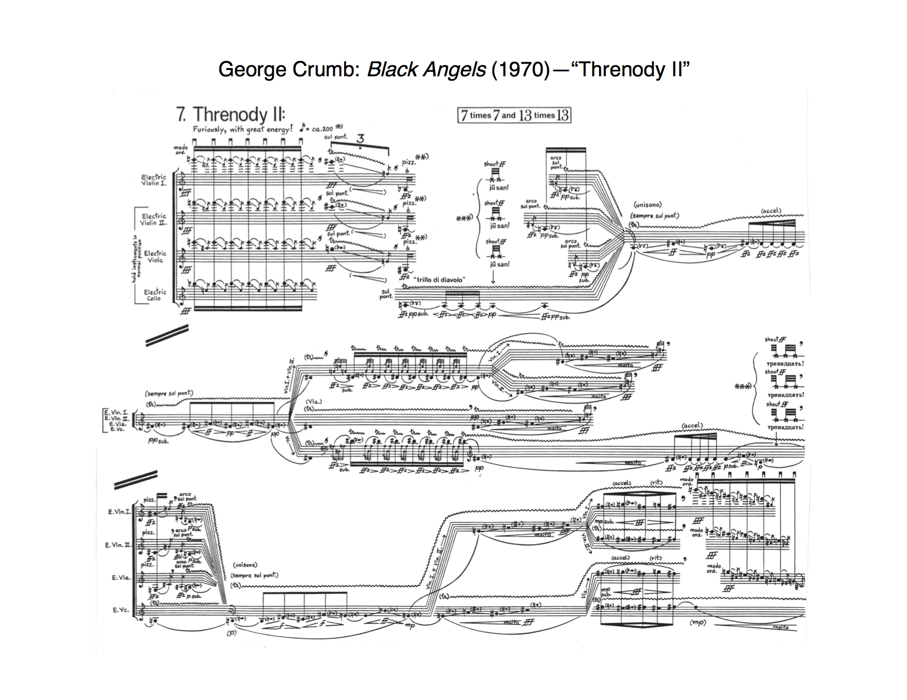
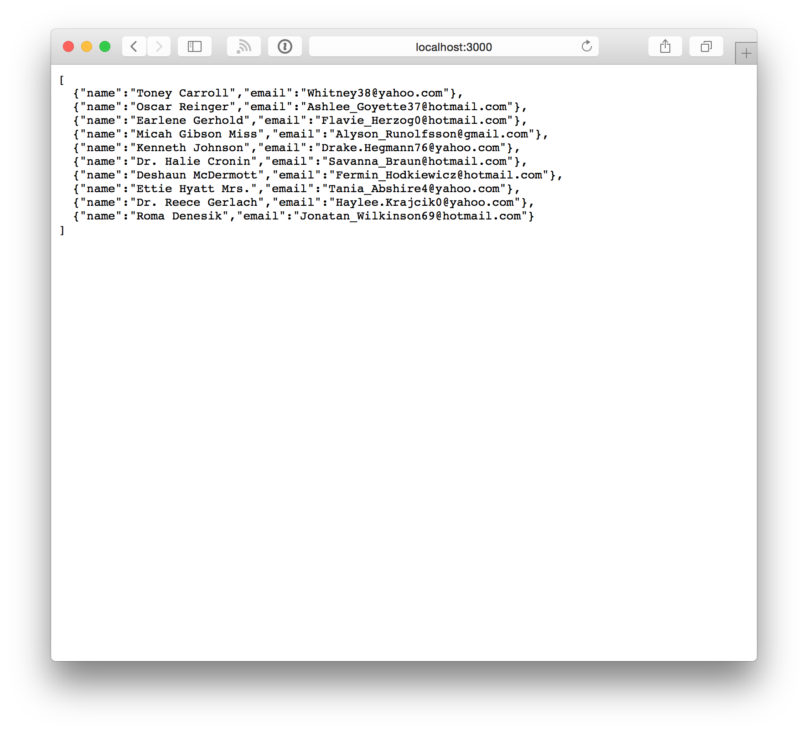
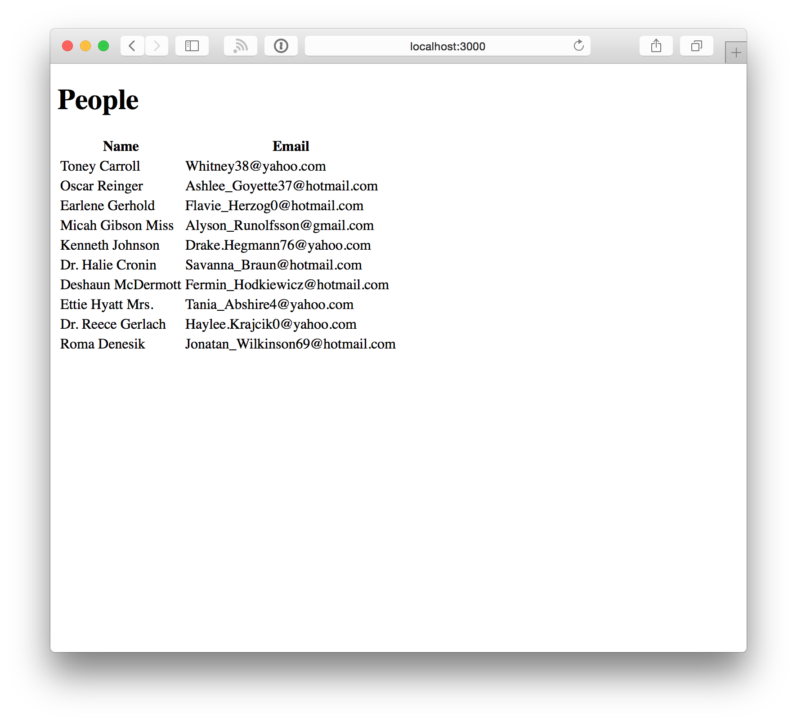

build-lists: true

# Functional Reactive Programming with Highland.js

^ Today I’d like to talk about Functional Reactive Programming with Highland.js, but this isn’t really a talk ••• about Highland.

---

# Functional Reactive Programming ~~with Highland.js~~

^ This is a talk about ••• functional programming

---

# [fit] Functional<br /> Programming

^ and ••• streams

---

# [fit] Streams

---

# [fit] Functional Programming

^ First let's talk about functional programming. Just so I can get an idea, by show of hands, how many people have done functional programming?

---

# What is functional programming?

^ So, what is functional programming? Well, it’s programming with functions. Obviously.

---

# Seriously, though.

---

# What is functional programming?

^ More specifically, it’s treating functions like any other data. Now what do I mean by “function”?

---

# What is a function?

> A function is a relation that uniquely associates members of one set with members of another set.
-- Wolfram MathWorld

$$
\sin\left(\frac{\pi}{2}\right) = 1
$$

^ If we remember back to our math class, “A function is a relation that uniquely associates members of one set with members of another set.” In other words, given an input, the output will always be the same. For example, sin(π/2) is always 1. It’s no different than using a lookup table. This is the basis of memoization, which we won’t be talking about.

---

# [fit] Features of<br />Functional Languages

^ What are some features of functional languages?

---

# First-Class Functions

```javascript
var a = function(x) {
	return 'Hello, ' + x + '!';
};

var b = a;
```

^ As a mentioned earlier, we treat function like any other data. Since we can assign functions to variables, and we can pass these functions around like any other value, we have first-class functions.

---

# Higher-Order Functions

```javascript
function b(fn, x) {
	return fn(x);
}
```

^ Next we have higher-order functions. These are just functions that take other functions as their arguments.

^ Some examples of higher-order functions are `map`, `reduce`, `filter`, and so on. You’ve probably seen these ideas in lodash or on the Array prototype.

---

# Map

```javascript
var square = function(n) {
	return n * n;
};

[1, 2, 3, 4].map(square);
// [1, 4, 9, 16]
```

^ Here’s an example of using map to return an array of squares.

---

# Reduce

```javascript
var product = function(a, b) {
	return a * b;
};

[1, 2, 3, 4].reduce(product, 1);
// 24
```

^ Here we use reduce to calculate the product of the values in an array.

---

# Filter

```javascript
var even = function(n) {
	return n % 2 === 0;
};

[0, 1, 2, 3, 4].filter(even);
// [0, 2, 4]
```

^ And here’s an example of filtering an array to give us only even numbers. Yes, zero is even.

---

# Referential transparency

^ Referential transparency is a fancy way to say functions always return the same value for a given input. What this does is let’s us apply a little math and create new functions by combining our old ones. This gives us…

---



# Composition

^ If we remember back to math class again…

---

# Composition

## $$\left(f \circ g\right)\left(x\right) = f\left(g\left(x\right)\right)$$

^ Composition is the creation of a new function by feeding the output of one function into the the input of another.

^ Notice we read right-to-left. First we apply `g` to `x`, then we apply `f`. So we’ll use a handy utility from whichever library we’ve chosen.

---

# $$f \circ g$$ with Ramda

Product of the squares of even numbers.

$$
product \circ square \circ even
$$

```javascript
var R = require('ramda');
var evenSquaresProduct = R.compose(
  R.reduce(product, 1),
  R.map(square),
  R.filter(even)
);

var result = evenSquaresProduct([1, 2, 3, 4]);
// [2, 4] -> [4, 16] -> 64
```

^ We are actually doing a couple of things here. On the second line you see the compose function. Remember, we have to read from right to left, so the input will first go through our even function, then the square function, and finally reduce.

^ You might also notice I am doing partial function application for reduce, map, and filter. Since these functions are curried, when apply only some of the arguments, a new function that takes the remaining arguments is returned. So each of those lines is returning a new function with a single parameter for the value that will be passed.

---

# Lazy evaluation

^ Because of referential transparency, we are able to do the computation at any time and get the same result. The computation is not dependent on any previous state. This allows us to have interesting things like infinite data sets and delayed lists. And, as it turns out, Node (and soon browsers) has a nice API for this.

---

# [fit] Streams

---

# Why streams?

* Lower memory overhead
* Throughput
* Deal with data when it’s available

^ Streams generally have ••• lower memory overhead, ••• higher throughput, and allow us to deal with data as it becomes available. Obviously this will depend on your data. With small data sets, pure callbacks were actually faster when running everything locally, but I couldn’t really push the system to its limits without running out of sockets first. 

---

# Performance

20 users, 100,000 documents, 1 minute

# Callbacks
> Transactions: 1
> Max Memory: 1.4 GB
> Availability: 5%
> Response Time: 44.32 s

^ One test I ran simulated 20 users continuously requesting 100,000 small documents for one minute. Anything more and I couldn’t get any results back without exhausting available memory when using MongoDB’s `toArray()`, which is quite costly, and callbacks.

---

# Performance

20 users, 100,000 documents, 1 minute

# Callbacks
> Transactions: 2,191
> Max Memory: 94 MB
> Availability: 100%
> Response Time: 0.54 s

^ Then I repeated the test with streams. Why so much better?

^ Streams are actually EventEmitters. We are able to handle small chunks of data as they become available without blocking the main thread for the expensive computations. We also don’t have to load the entire data structure into memory before doing any computation.

---

# What are Streams?

^ OK, but _what are streams_?

---

# What are Streams?

```sh
# Make your clipboard shouty in OS X.
$ pbpaste | tr '[:lower:]' '[:upper:]' | pbcopy
```

^ Think of Unix. We take the output of one command and _pipe_ it into the input of the next. Streams even use the word “pipe” in the API.

---

# Pipe

```javascript
var fs = require('fs');
var file = fs.createReadStream('./path/to/file.txt');
file.pipe(process.stdout);
```

^ First we’ll look at some untested code of how to read a file from disk, and print it to standard out.

---

# Pipe

```javascript
var AWS = require('aws-sdk');
var s3 = new AWS.S3();

function requestHandler(request, response) {
	var params = {} // Bucket, key, etc.
	var downloadStream = s3.getObject(params).createReadStream();
	downloadStream.pipe(response);
}
```

^ We can do the same thing if I’m, let’s say, streaming a file from an Amazon S3 bucket to a client in this totally untested code. Why we would do this instead of a redirect is irrelevant. Maybe we want to apply a filter first, but we’ll ignore that for now.

^ The response object in the Node HTTP module support streams. As a result, streams are also supported in things like Hapi and Express.

---

# Highland.js

> The high-level streams library for Node.js and the browser.

^ And we’ve finally made it to Highland.js. Highland gives you a uniform interface for dealing with synchronous and asynchronous data sources by leveraging Node’s streams.

---

# Alternatives

* RxJS
* Bacon.js

^ There are alternatives. RxJS is the batteries included library, and Bacon.js is more hipstery.

---

# $$f \circ g$$ with Highland.js

```javascript
var _ = require('highland');
var evenSquaresProduct = _.compose(
  _.reduce(1, product),
  _.map(square),
  _.filter(even)
);

var result = evenSquaresProduct([1, 2, 3, 4]);
// Not actually a result, but a lazy stream.

result.invoke('toString', [10]).pipe(process.stdout);
```

^ Let’s take a look at the functional composition example I did earlier in Ramda, but using Highland. Now with Ramda when we called `evenSquaresProduct`, we had a value. Not so with Highland. Remember how we talked about lazy evaluation? Well, Highland streams are lazy. Nothing happens until you ••• thunk.

---

# Thunk

* each
* done
* apply
* toArray
* pipe
* resume

^ Here are some examples of methods that cause thunks.

---

# What’s with the _()?

---

# Highland Stream Constructor _()

* Array
* Generator
* Node Readable Stream
* EventEmitter
* Promise
* Iterator
* Iterable

^ The constructor can take in an ••• array, ••• a generator, ••• a readable stream, ••• an EventEmitter, ••• a Promise, ••• and Iterator, ••• or an Iterable.

^ You might think it’s strange that a Promise could be turned into a stream since it only ever settles once. What Highland does is turns the promise into a stream that emits one event when the promise settles with either a value or an error depending on whether the Promise is fulfilled or rejected.

---

# Highland Stream Constructor _()

```javascript
var myStream = _();
myStream.write(1);
myStream.write(2);
myStream.write(3);
myStream.end();
```

^ You can also use an empty constructor to manually push and end the stream. You shouldn’t normally need this, but I have played with it when, for example, receiving messages from RabbitMQ.

---

# Generator to Stream

```javascript
function* numberGenerator() {
	yield 1;
	yield 2;
	yield 3;
	yield 4;
}

var result = evenSquaresProduct(numberGenerator());
result.invoke('toString', [10]).pipe(process.stdout);
```

^ Here I have used an ES6 generator instead of an array, but the result is the same.

---

# Real-World Example

* Get data from MongoDB
* Map objects to view model
* Serialize to JSON
* Output HTML

^ Finally, I’m going to show you something that might be useful in the real world. We’ll ••• get some data from a Mongo database, we’ll ••• map the data to something appropriate for the response, and then we’ll spit out JSON. Finally we’ll use Dust to stream an HTML response to the browser because we still believe in progressive enhancement. It’s also the quickest way to get your first paint.

---

# Real-World Example (JSON)

```javascript
var JSONStream = require('JSONStream');

function nameEmail(person) {
	return {
		name: person.firstName + ' ' + person.lastName,
		email: person.email
	};
}

function requestHandler(request, response) {
 	response.writeHead(200, {'Content-Type': 'application/json'});
	var people = db.collection('people').find({}).stream();
	var json = JSONStream.stringify();
	_(people).map(nameEmail).pipe(json).pipe(response);
}
```

^ For the sake of time and screen real estate, I’ve omitted setting up a database connection and starting the server. You’ll notice that I have two pipes—one to json and one to response. This is because we are in object-mode, and the ServerResponse object doesn’t know how to handle that.

^ We can use the JSONStream package to help us out here. It’s not going to be quite as fast as the native stringifier, but that’s almost certainly not your bottleneck, anyway.

---



---

# Real-World Example (HTML)

```javascript
var Dust = require('dustjs-linkedin');

var compiled = Dust.compile(templateSrc, 'template');
Dust.loadSource(compiled);
var template = _.partial(Dust.stream, 'template');

function requestHandler(request, response) {
 	response.writeHead(200, {'Content-Type': 'text/html'});
	var findStream = db.collection('people').find({}).stream();
	var people = _.map(nameEmail, findStream);
	var context = {people: people};
	template(context).pipe(response);
}
```

^ The HTML version is almost the same, but instead we pipe some context to a Dust template. The reason I chose Dust is because it streams what it can to the client, and when it encounters a Promise or Stream in its context, it just waits until it’s available and then keeps streaming. Just for fun I threw in a little partial function application. Normally you’d resolve the template name through a router or something.

---

# Dust Template

```html
<!DOCTYPE html>
<html lang="en">
	<head>
		<meta charset="UTF-8">
		<title>OKC.js Lightning Talk, Round 10</title>
	</head>
	<body>
		<h1>People</h1>
		<table>
			<thead>
				<tr>
					<th>Name</th>
					<th>Email</th>
				</tr>
			</thead>
			<tbody>
				{#people}<tr><td>{name}</td><td>{email}</td></tr>{/people}
			</tbody>
		</table>
	</body>
</html>
```

---



---

# @nlindley